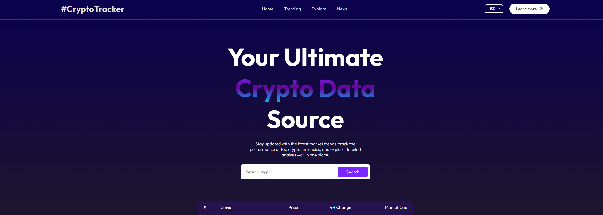
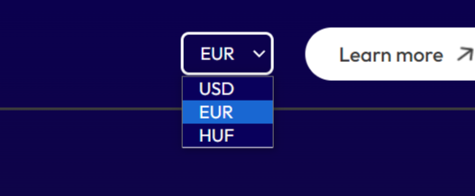
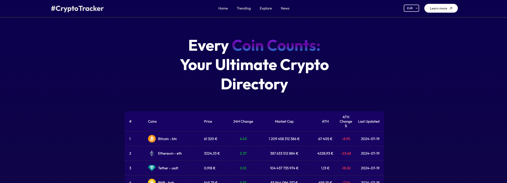
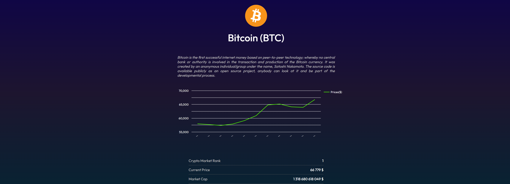
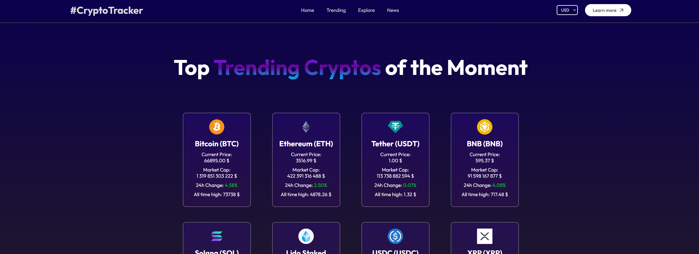
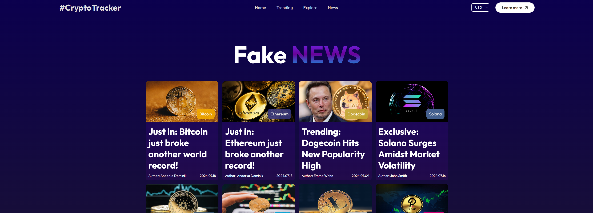
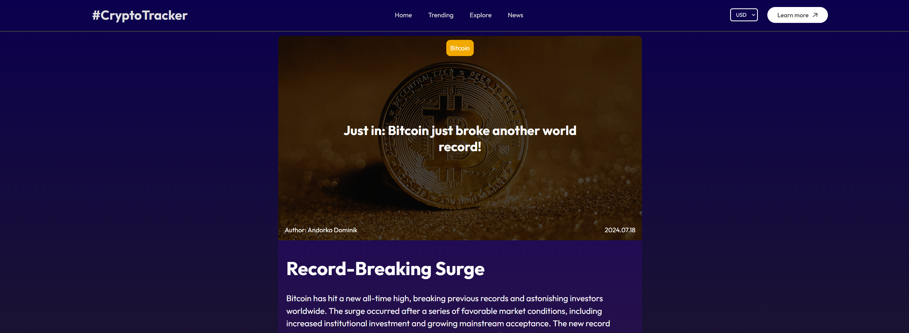

# CryptoTracker

CryptoTracker is a comprehensive cryptocurrency tracking application that allows users to stay updated with the latest market trends, track the performance of top cryptocurrencies, and explore detailed analysis—all in one place. This project is built using React and fetches data from the CoinGecko API.

<h3 align="center">
    <strong>
      <code>&nbsp;<a href="https://andorkadominik.github.io/CryptoTracker/">Access Here</a>&nbsp;</code>
    </strong>
</h3>

## Table of Contents

1. [Introduction](#introduction)
2. [Dynamic Currency Switching](#dynamic-currency-switching)
3. [Pages](#pages)
   - [Home](#home)
   - [All Coins](#all-coins)
   - [Coin Details](#coin-details)
   - [Trending Coins](#trending-coins)
   - [News](#news)
   - [BlogPost](#blogpost)
4. [Components](#components)
   - [LineChart](#linechart)
   - [CoinCard](#coincard)
5. [Context](#context)
6. [API Integration](#api-integration)
7. [Navbar](#navbar)

## Introduction

CryptoTracker is designed to provide real-time data and comprehensive information about various cryptocurrencies. The app includes features like a detailed coin overview, historical data charts, trending coins, and a news section with blog posts 
related to cryptocurrencies.

## Dynamic Currency Switching

One of the key features of CryptoTracker is the ability for users to switch between different currencies (USD, EUR, HUF), and have the entire app update accordingly.

**Features:**
- **Seamless Currency Switching**: Users can select their preferred currency from the navbar, and the app will update all relevant data to reflect prices in the chosen currency.
- **Global State Management**: The selected currency is managed using React Context, allowing for a consistent and responsive update across all components.

**Code Highlights:**
- The `currencyHandler` function in the `Navbar` component updates the selected currency in the global context.
- Components that display price or market data (e.g., `Home`, `CoinDetails`, `TrendingCoins`) consume the `CoinContext` to get the current currency and update their data accordingly.
- The `useEffect` hooks in various components trigger data fetching or re-rendering when the selected currency changes, ensuring all displayed data is current.

## Pages

### Home

The Home page provides a quick overview of the top 10 cryptocurrencies by market cap. Users can search for specific cryptocurrencies using the search bar.

**Features:**
- **Hero Section**: A welcoming section with a brief description of the application.
- **Search Bar**: Allows users to search for cryptocurrencies by name.
- **Top 10 Cryptocurrencies**: Displays the top 10 cryptocurrencies, including their rank, name, price, 24-hour change, and market cap.

**Code Highlights:**
- The `inputHandler` function updates the search input state.
- The `searchHandler` function filters the list of cryptocurrencies based on the search input.
- `useEffect` hooks are used to fetch and display the list of all cryptocurrencies.

### Explore page

The Explore page lists all available cryptocurrencies. Users can see detailed information such as rank, price, 24-hour change, market cap, all-time high (ATH), and ATH change percentage.

**Features:**
- **Comprehensive List**: A complete list of all cryptocurrencies.
- **Detailed Information**: Displays each coin’s rank, name, price, 24-hour change, market cap, ATH, and ATH change percentage.
- **Navigation Links**: Each coin links to its detailed information page.

**Code Highlights:**
- `useEffect` hook is used to update the displayed coins whenever the list of all coins changes.
- The `Link` component from `react-router-dom` is used for navigation to individual coin detail pages.

### Coin Details

The Coin Details page provides detailed information about a specific cryptocurrency, including its description, current price, market cap, 24-hour high and low prices, and a historical price chart.

**Features:**
- **Coin Overview**: Displays the coin’s image, name, and symbol.
- **Description**: A brief description of the coin.
- **Historical Data Chart**: A line chart showing the coin’s price over the past 10 days.
- **Market Data**: Detailed market information including current price, market cap, 24-hour high and low prices.

**Code Highlights:**
- `useParams` is used to get the `coinId` from the URL.
- `useContext` is used to get the selected currency from `CoinContext`.
- `fetchCoinData` and `fetchHistoricalData` functions are used to fetch data from the CoinGecko API.
- The `LineChart` component is used to display historical price data.

### Trending Coins

The Trending Coins page showcases the top 12 cryptocurrencies by market cap. Each coin card displays the coin’s name, current price, market cap, 24-hour change, and ATH.

**Features:**
- **Top 12 Coins**: Displays the 12 most popular cryptocurrencies by market cap.
- **Coin Cards**: Each card shows the coin’s image, name, symbol, current price, market cap, 24-hour change, and ATH.

**Code Highlights:**
- `useEffect` hook is used to sort and display the top 12 cryptocurrencies.
- `Link` component is used for navigation to individual coin detail pages.

### News

The News page displays a list of blog posts related to cryptocurrencies. Each post includes an image, title, author, and publication date.

**Features:**
- **Blog Posts**: Displays a list of blog posts with images, titles, authors, and publication dates.
- **Navigation Links**: Each post links to its detailed news page.

**Code Highlights:**
- `useEffect` hook is used to scroll to the top of the page when it is rendered.
- The `Link` component is used for navigation to individual news detail pages.

### BlogPost

The BlogPost page displays the full content of a selected blog post. It includes the title, author, publication date, and detailed content sections.

**Features:**
- **Post Content**: Shows the blog post title, author, publication date, and content.
- **Related Coin Details**: Optionally displays related coin details if available.
- **Navigation Links**: Provides a link to the News page.

**Code Highlights:**
- `useParams` is used to get the `shortName` from the URL.
- `useContext` is used to get data from `CoinContext`.
- `useEffect` hook is used to scroll to the top of the page when it is rendered.
- The `Link` component is used for navigation to the News page.

## Components

### LineChart

The `LineChart` component is used to display the historical price data of a cryptocurrency in a line chart format.

**Features:**
- **Dynamic Data**: Updates the chart based on the fetched historical data.
- **Responsive Design**: Adjusts to different screen sizes for better user experience.

**Code Highlights:**
- Utilizes a charting library (e.g., Chart.js or Google Charts) to render the line chart.
- Props are used to pass historical data to the component.

### CoinCard

The `CoinCard` component is a reusable card component to display information about a specific coin in the Trending Coins and All Coins pages.

**Features:**
- **Reusable**: Can be used in multiple pages to display coin information.
- **Stylized**: Includes styling to present coin data in an attractive manner.

**Code Highlights:**
- Receives props to display coin information such as image, name, price, and market cap.
- `Link` component is used to navigate to the coin details page.

## Context

The `CoinContext` provides global state management for the application. It includes data such as the list of all coins and the selected currency.

**Features:**
- **Global State Management**: Allows sharing of data across different components without prop drilling.
- **Currency Management**: Keeps track of the selected currency and updates components accordingly.

**Code Highlights:**
- `useContext` is used to consume the context in various components.
- Provides a state for all coins and the selected currency, along with functions to update them.

## API Integration

The application fetches data from the CoinGecko API. API requests are made to get information about specific coins and their historical data. Make sure to replace the placeholder API key with your own in the fetch requests.

**Features:**
- **Data Fetching**: Retrieves real-time data about cryptocurrencies.
- **Error Handling**: Includes error handling for failed API requests.

**Code Highlights:**
- `fetchCoinData` and `fetchHistoricalData` functions make API requests to get coin data and historical price data.
- `useEffect` hooks are used to trigger data fetching when the component mounts or when the selected currency changes.

## Navbar

The `Navbar` component provides the navigation menu for the application. It includes links to the Home, Trending Coins, All Coins, and News pages, as well as a currency selector.

**Features:**
- **Responsive Navigation**: A responsive navbar that adjusts for different screen sizes.
- **Currency Selector**: Allows users to switch between different currencies (USD, EUR, HUF).
- **Navigation Links**: Links to the main pages of the application.

**Code Highlights:**
- `useRef` and `useState` are used to manage the navbar’s open/close state.
- `FaBars` and `FaTimes` from `react-icons` are used for the menu icons.
- `Link` component from `react-router-dom` is used for navigation.

## License

This project is licensed under the MIT License. See the [LICENSE](LICENSE) file for more details.

